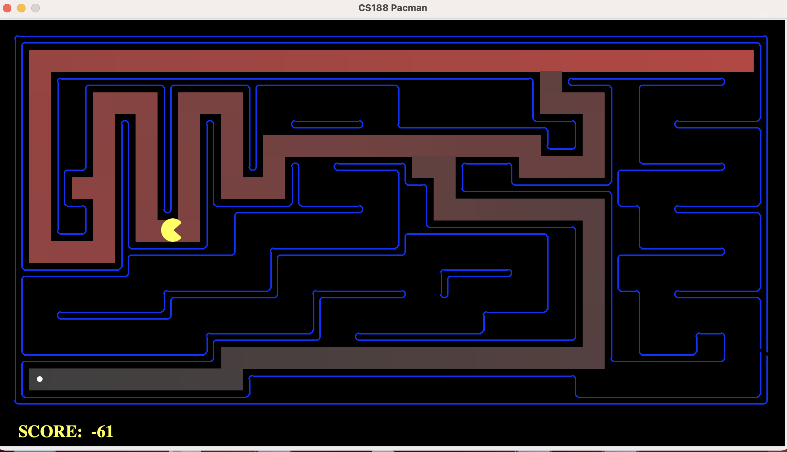

# pacman-search
Pacman search project


## Texas Tech University </h2>

## Fall 2021

This contains Pac-Man project which was adopted from UC Berkeley's introductory artificial intelligence class, CS 188. It explores several techniques of Artificial Intelligence such as Searching, Heuristics, Adversarial Behaviour, Reinforcement Learning etc.

**Project 1: Search** - Algorithms used are DFS, BFS, UCS, Greedy Search, A* Search

## Requirements 
Python 3.6 or lower versions. It doesn't work for higher versions of python.
## Installation
Clone this project to your local repository
```
git clone https://github.com/kedhar0608/pacman-search.git
```
Then run the following tests to see if it's working.
### DFS
Small Maze
```
python pacman.py -l tinyMaze -p SearchAgent
```
Medium Maze
```
python pacman.py -l mediumMaze -p SearchAgent
```
Big Maze
```
python pacman.py -l bigMaze -z .5 -p SearchAgent

```


### BFS
```

python pacman.py -l mediumMaze -p SearchAgent -a fn=bfs
python pacman.py -l bigMaze -p SearchAgent -a fn=bfs -z .5
```


